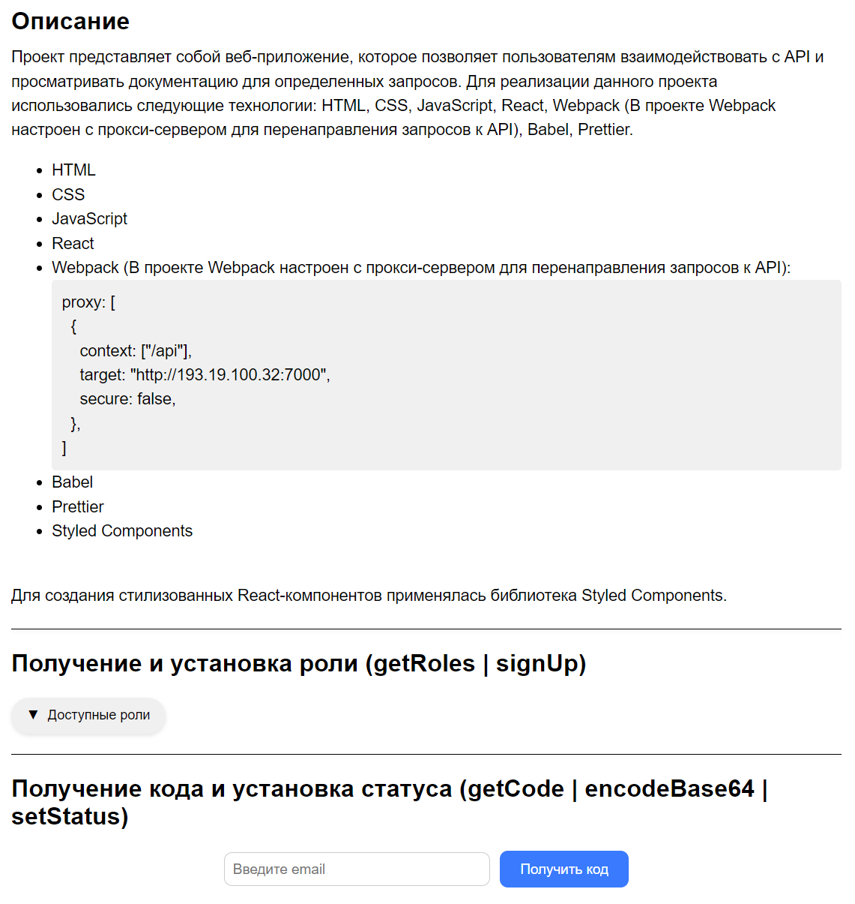

# Проект Bogdan-Swagger-Interface

## Описание
Проект представляет собой веб-приложение, которое позволяет пользователям взаимодействовать с API и просматривать документацию для определенных запросов. 

Для реализации данного проекта использовались следующие технологии:

- HTML
- CSS
- JavaScript
- React
- Webpack (В проекте Webpack настроен с прокси-сервером для перенаправления запросов к API):
  
  ```js
  proxy: [
    {
      context: ["/api"],
      target: "http://193.19.100.32:7000",
      secure: false,
    },
  ]

- Babel
- Prettier
- Styled Components для создания стилизованных React-компонентов
- Приложение адаптировано под мобильные устройства

---


## Инструкция по запуску
Убедитесь, что у вас установлен Node.js.
Склонируйте репозиторий с проектом:
```bash
git clone https://github.com/B0gda/Swagger-Interface-API.git
```
Перейдите в директорию проекта:
```bash
cd Swagger-Interface-API
```
Установите зависимости:
```bash
npm install
```
Запустите приложение:
```bash
npm start
```
Откройте браузер и перейдите по адресу ` http://localhost:9000 ` для просмотра приложения.

---

## Визуализация интерфейса


